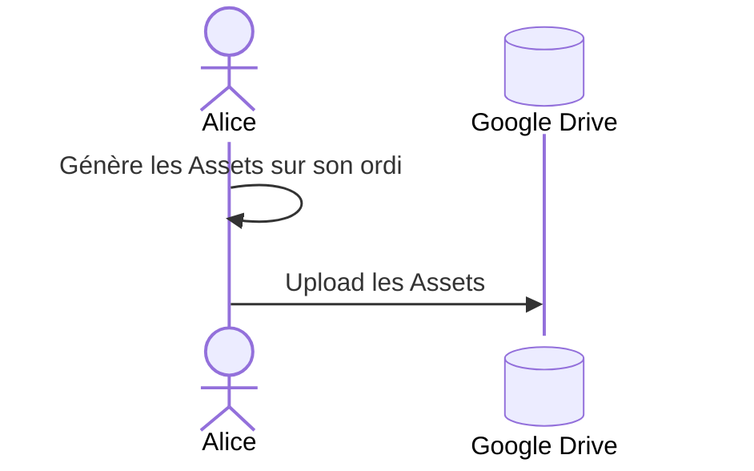
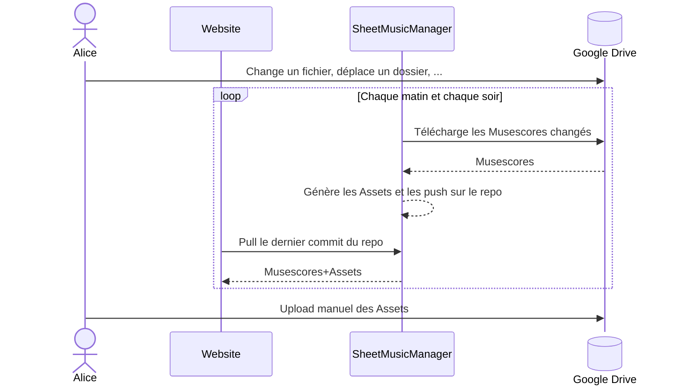
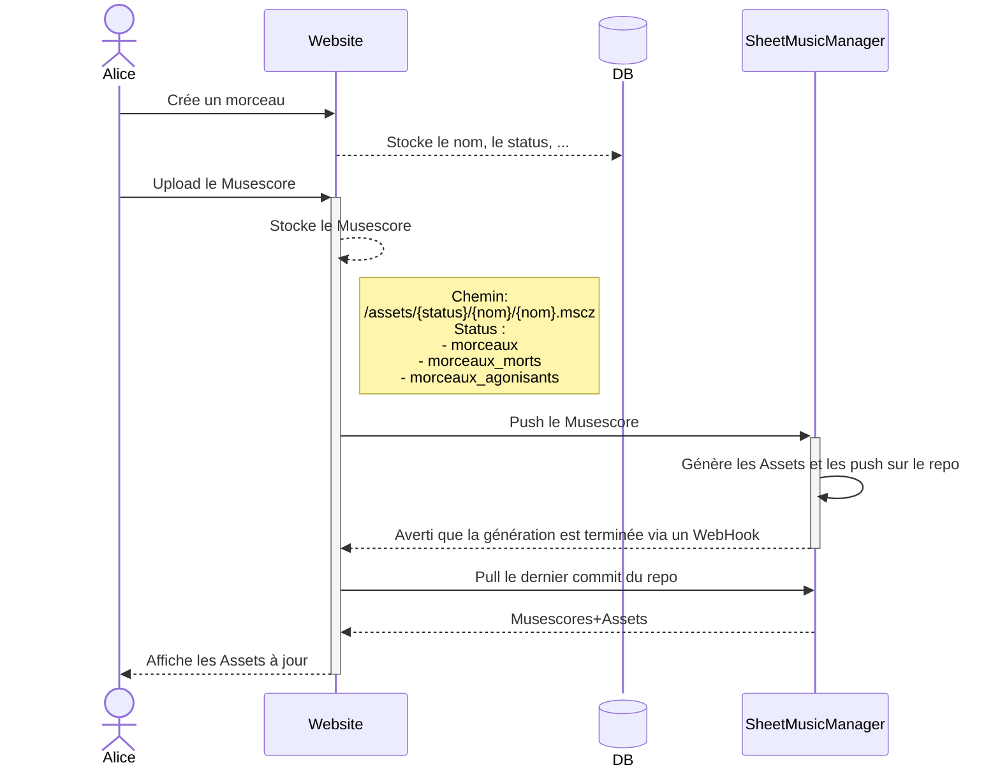

# Gestion des partitions

## Besoin

- Générer les PDFs et les Audios à partir des Musescores

## Contraintes

- Impossible d'installer le logiciel Musescore sur la plupart des hébergement web, qui permet de lire les Musescores et de générer les PDFs et les Audios
- Versionner les Musescores

## Définitions

- SheetMusicManagement : repo https://github.com/los-teoporos/sheet-music-management 
- Github Action : script éxécuté sur github, permettant d'automatiser certaines tâches, comme la génération des pdfs et des audios
- Site : le site web de Losteoporos, repo https://github.com/los-teoporos/website
- Google Drive : le google drive partagé contenant entre-autre les partitions, rangées par status
- Google Sheet : le google sheet permettant à la fanfare de s'organiser, qui contient aussi les notes des morceaux, les setlists, ...
- Musescores : fichiers contenant les partitions
- PDFs : partition des morceaux, et carnets pour chaque instrument
- Audios : audios MIDI généré à partir des Musescores
- Assets : PDFs + Audios

## Fonctionnement

### 1. Manuel : Google Drive

Aucun lien avec le status des morceaux dans le Google sheet, ni aucun lien avec le site affichant les notes, les PDFs, les Audios, les setlists.

Il faut avoir la configuration sur son ordinateur (styles, icones, etc) et les scripts pour générer les Assets avec musescore (accessible sur le repo SheetMusicManagement)

Ensuite, il faut uploader les fichiers modifiés sur le drive.

### 2. Semi-automatisé : Google Drive -> Github -> Site

Les Musescores et Assets sont sur le Google Drive. 
La Github Action du SheetMusicManagement génère les Assets, mais il est impossible de les upload automatiquement sur le Google Drive.

Ainsi, pour mettre à jour une partition sur le Site, il faut mettre à jour le Google Drive, attendre la génération sur SheetMusicManagement, puis upload manuellement les Assets sur le Google Drive.

### 3. Automatisé : Site <-> Github 

Tout se fait depuis le Site, les Musescores+Assets sont stockés sur le repo SheetMusicManagement qui permet:
- de conserver un historique des modifications
- de générer les Assets via la Github Action
- de garder une architecture de dossiers humainement lisible et utilisable sans le site

> [!NOTE]
> Modifier le status d'un morceau déplacera le dossier contentant Musescore+Assets dans le dossier correspondant au status et re-génèrera les carnets si besoin

